**OBJECTIVE**:

To study the mechanical properties of cast iron specimen under tension load.

**STEPS**:

1. Click on the Tensile Test on Cast iron file, a window will open as shown.  
   [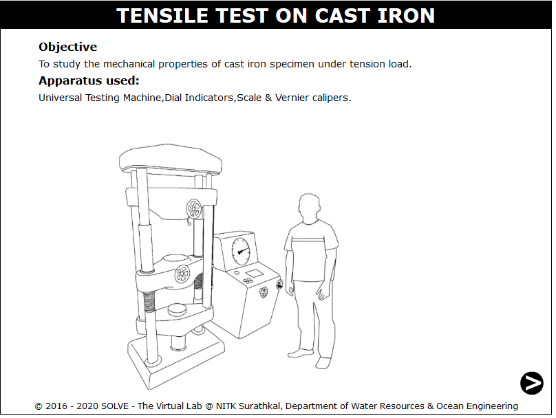](./images/proc1.png)

2. Click on the NEXT button to move to the next step.  
   [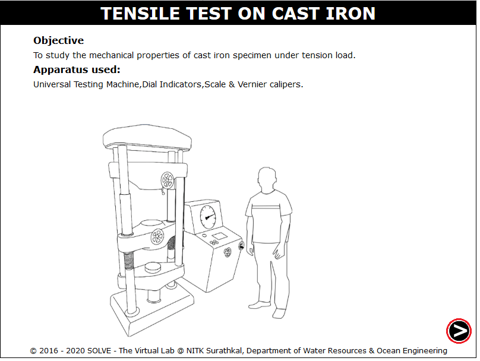](./images/proc2.png)

3. To measure the diameter of the specimen click on Vernier Caliper.  
   [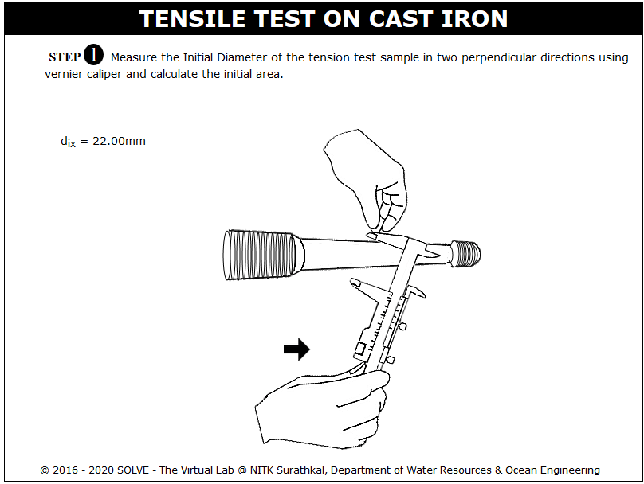](./images/proc3.png)

4. To measure the length of the specimen between the grips click on measuring scale.  
   [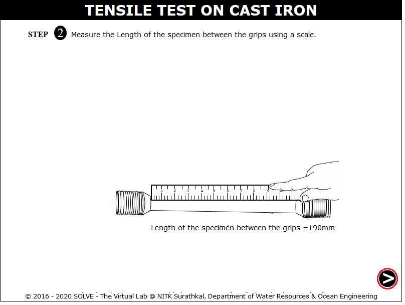](./images/proc4.png)

5. Click on hammer to make punch mark at a distance of 2.5d.  
   [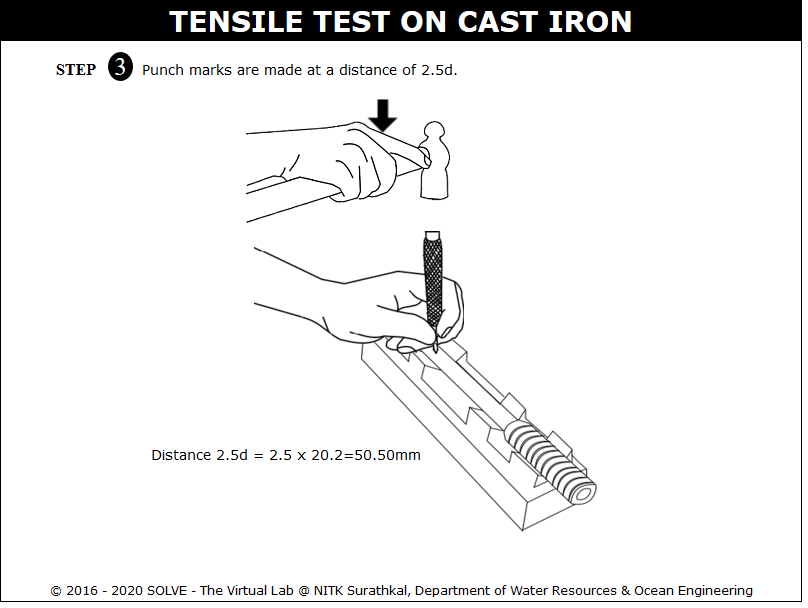](./images/proc5.png)

6. Click on the roatating lever to lower the machine bottom part, drag the specimen and place it on the position where the arrow is pointing ,then again click on rotating lever to adjust the height and then the dial gauge is mounted.  
   [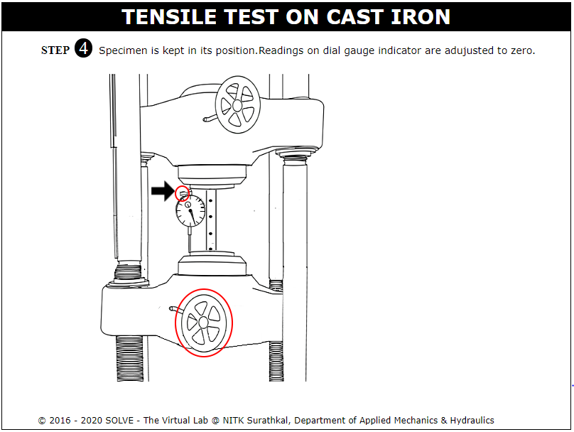](./images/proc6.png)

7. Click on the green button to ON the Machine to get the extensometer readings for different load interval there is a option to download the dial gauge reading.  
   [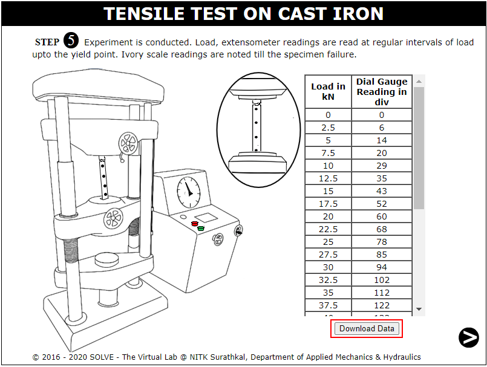](./images/proc7.png)

8. Graph of Load vs Dial Gauge Reading obtained, click on View Data or View Slope to view the test results.  
   [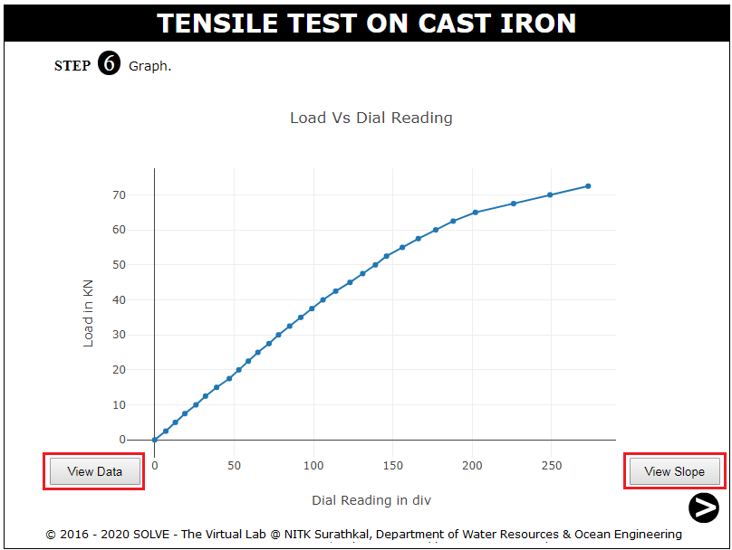](./images/proc8.png)

9. Click on Join the pieces of the specimen to join it to measure the change in diameter.  
   [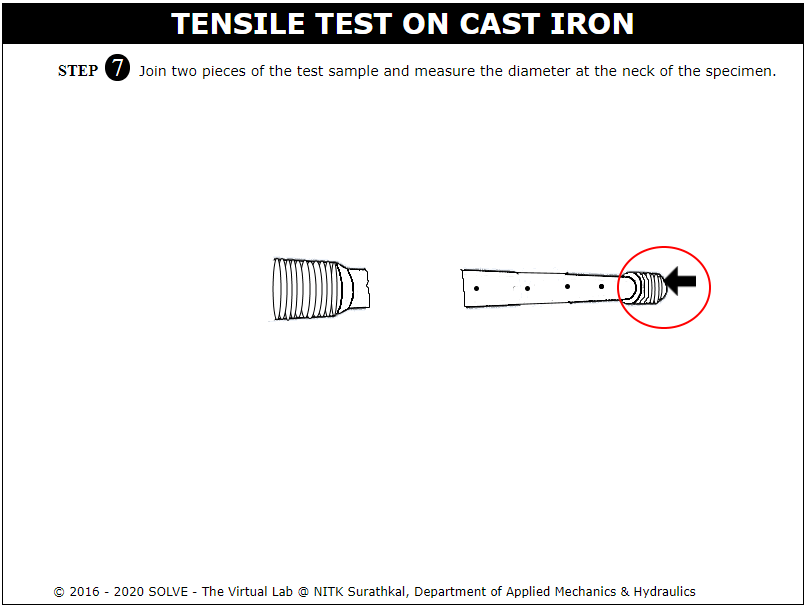](./images/proc9.png)

10. Join the two specimen to measure the change in specimen length.  
    [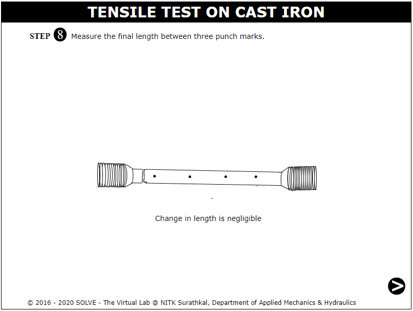](./images/proc10.png)

11. Input the calulated result and then click on Check to view the actual result.  
    [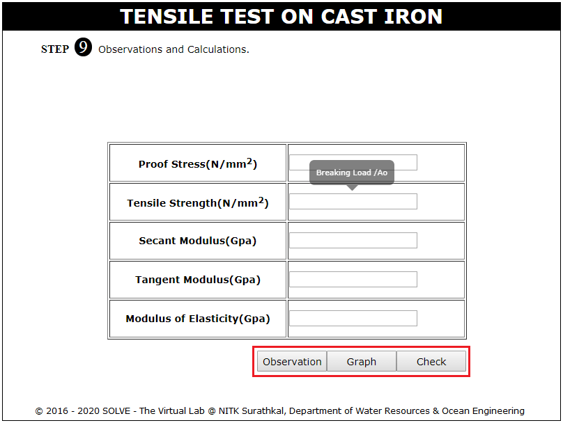](./images/proc11.png)
